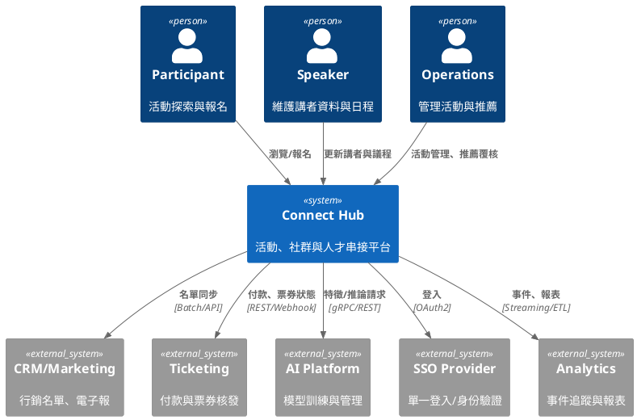
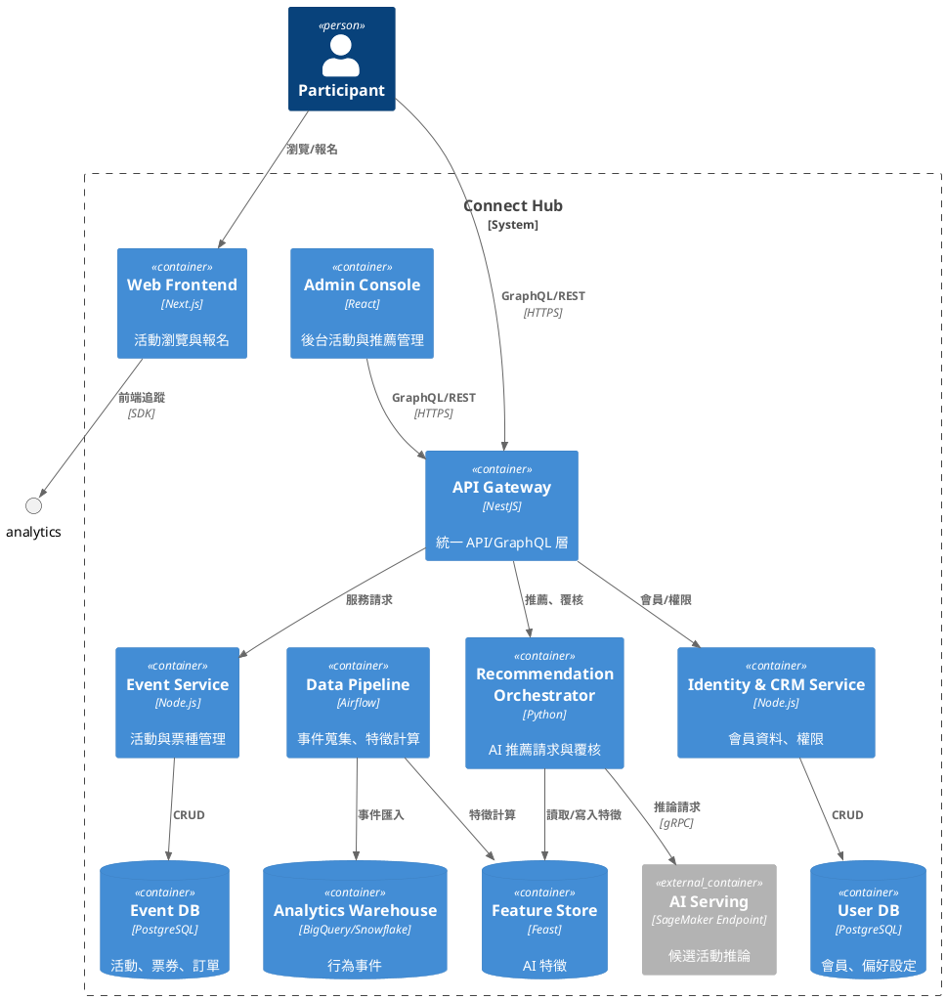
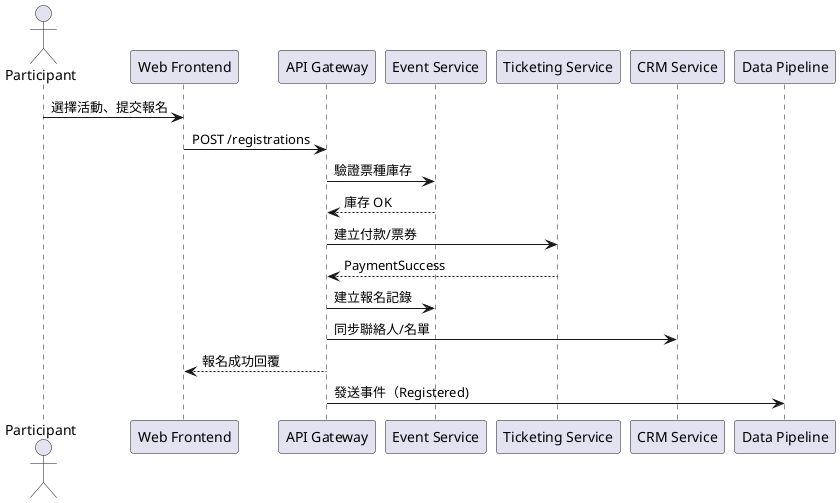
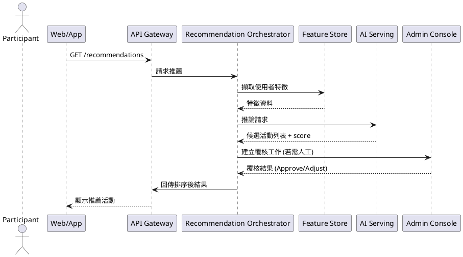
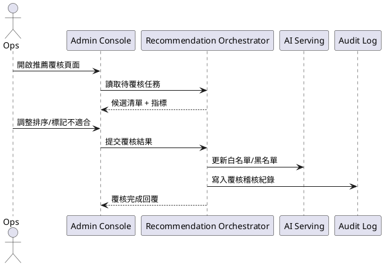

# Connect Hub 設計架構參考指南

本指南提供系統架構師（SA）與跨職能團隊在設計階段撰寫細部設計文件時可直接套用的架構視角、流程描述與序列圖範例。所有內容均對應《requirements.md》與《mvp-development-plan.md》所界定的 MVP 範圍，以及《ai-dlc-adoption-plan.md》的導入步驟。

---

## 1. 架構視角總覽
| 視角 | 目的 | 主要產出 | 工具建議 |
| --- | --- | --- | --- |
| 系統上下文（Context） | 說明 Connect Hub 與外部角色/系統的邊界與資料交換 | Context Diagram、整合介面列表 | Draw.io、PlantUML C4、Miro |
| 容器與元件（Container & Component） | 拆解前後台、API、資料處理、AI 服務等關鍵組件 | C4 Container Diagram、Component 說明表 | Structurizr、PlantUML C4、Mermaid |
| 部署（Deployment） | 定義環境、節點與部署拓撲，涵蓋 CI/CD 佈署流程 | Deployment Diagram、節點配置表 | PlantUML、Lucidchart |
| 資料與 AI（Data & AI） | 鋪陳資料流、儲存設計與模型服務化策略 | ERD、DFD、AI Pipeline 示意圖 | dbdiagram.io、Mermaid、Draw.io |
| 流程與序列（Process & Sequence） | 描述跨模組流程、服務互動細節 | BPMN/活動圖、Sequence Diagram | Camunda Modeler、PlantUML、Mermaid |

---

## 2. 系統上下文與整合清單

### 2.1 上下文描述
- **核心使用者**：活動參與者、講者/合作夥伴、營運人員、系統管理員。
- **主要外部系統**：企業 SSO / OAuth 提供者、CRM/行銷自動化平台、支付/票務服務、AI 模型訓練平台（MLflow / SageMaker）、分析/追蹤工具。
- **資料流向**：
  - 參與者 ⇄ 前台 Web/App ⇄ API Gateway ⇄ 活動管理服務。
  - 後台 CMS ⇄ API Gateway ⇄ 報名/庫存管理、推薦覆核服務。
  - AI 特徵管線 ⇄ 特徵儲存 ⇄ 推薦引擎 ⇄ API Gateway。
  - 事件匯流排 ⇄ 追蹤資料倉儲 ⇄ 分析儀表板。

### 2.2 C4 Context 圖範例（PlantUML）

> 輸出圖檔可使用 PlantUML CLI 或 VS Code 外掛生成，並納入設計文件附錄。

### 2.3 整合介面清單（樣板）
| 介面名稱 | 來源/目標 | 協定 | 傳輸資料 | 安全控制 | 備註 |
| --- | --- | --- | --- | --- | --- |
| SSO OAuth | Connect Hub ⇄ OAuth Provider | HTTPS / OAuth2 | ID Token、Profile | PKCE、Token 逾期控管 | 需支援組織階層對應 |
| Ticketing Webhook | Ticketing → Connect Hub | HTTPS Webhook | Order Paid/Refunded | HMAC、IP 白名單 | 逾時重送須冪等 |
| AI 推薦 API | Connect Hub ⇄ AI Platform | REST/gRPC | Feature Payload、Rec Response | mTLS、簽章 | 支援離線批次覆核 |

---

## 3. 容器與元件設計

### 3.1 Container Diagram 範例（PlantUML）

### 3.2 元件責任表（摘要）
| 元件 | 主要職責 | 關聯需求（requirements.md） | 備註 |
| --- | --- | --- | --- |
| Event Service | 建立/維護活動、票種、時段、報名設定 | FR-01, FR-02, FR-05 | 提供 Webhook 給票務系統 |
| Recommendation Orchestrator | 觸發與整合 AI 推薦、封裝覆核流程 | AI-FR-01, AI-FR-03 | 支援批次與即時模式 |
| Admin Console | 管理活動與 AI 推薦覆核 | FR-07, AI-FR-04 | 與 RBAC 整合 |
| Data Pipeline | 擷取事件、清洗並送入特徵儲存 | NFR-04 | 監控延遲、品質指標 |

---

## 4. 部署與營運設計

### 4.1 部署拓撲（範例）
- **環境區分**：Dev、Staging、Production；AI Sandbox 與正式服務需獨立 VPC。
- **CI/CD 流程**：
  1. Git 提交 → CI 執行單元測試/靜態檢查。
  2. 成功後自動建置 Docker 映像並推送至容器登錄。
  3. CD 透過 ArgoCD / GitOps 同步至 Kubernetes；Staging 通過覆核後才允許 Production。
- **營運監控**：整合 Prometheus/Grafana、OpenTelemetry Trace、ELK 日誌；AI 模型監控包含推論延遲、命中率、偏誤指標。

### 4.2 節點配置表
| 節點/服務 | 容器 | 托管環境 | 延展策略 | 高可用策略 |
| --- | --- | --- | --- | --- |
| Frontend CDN | Web Frontend | CloudFront/Edge | 自動快取更新 | 多區域備援 |
| API Cluster | API Gateway、各微服務 | EKS/GKE | HPA CPU/Req | 滾動更新、Pod PodDisruptionBudget |
| Feature Store | Feast + Redis/BigTable | Managed Service | 分區/快取 | 定期備份、跨區複寫 |
| Analytics Warehouse | BigQuery/Snowflake | SaaS | 查詢階層自動擴展 | 權限與稽核日志 |

---

## 5. 流程、活動與序列圖

### 5.1 活動流程圖（BPMN 文字描述）
1. 參與者進入平台 → 檢視推薦活動列表。
2. 選擇活動 → 系統檢查票種可用量 → 顯示報名表單。
3. 參與者提交資料 → 觸發支付（若為付費） → 票務服務回傳狀態。
4. 報名成功 → 寄送通知、更新 CRM、寫入行為事件。
5. AI 管線將報名事件回饋特徵庫，供後續推薦優化。

> BPMN 可使用 Camunda Modeler 建模，文件需標註泳道（Participant、API Gateway、Ticketing、CRM、AI Pipeline）。

### 5.2 Sequence Diagram：活動報名（PlantUML）

### 5.3 Sequence Diagram：AI 推薦與覆核

### 5.4 Sequence Diagram：後台推薦覆核

---

## 6. 資料與 AI 設計指引

### 6.1 ERD 核心實體（文字描述）
- **Event**：活動主檔（名稱、主題、時間、地點、容量）。
- **Session**：子議程（對應 Event，多對一）。
- **TicketType**：票券種類（價格、庫存、條件）。
- **Registration**：報名資料（會員、票種、狀態、支付資訊）。
- **MemberProfile**：會員基本資料、興趣標籤、組織屬性。
- **InteractionLog**：瀏覽、收藏、報名行為，用於特徵計算。
- **RecommendationSnapshot**：AI 推薦結果與覆核狀態紀錄。

### 6.2 資料管線範例
| Stage | 工具/技術 | 描述 | 品質指標 |
| --- | --- | --- | --- |
| Ingestion | Kafka / Kinesis | 收集前端事件、後台操作 | 延遲 < 5 分鐘、重送率 |
| Processing | dbt / Spark | 清洗、特徵工程 | 任務成功率、欄位完整性 |
| Serving | Feast / Redis | 提供線上特徵 | 命中率、TTL 控制 |
| Monitoring | MLflow / Evidently | 追蹤模型表現與漂移 | Precision@K、Drift Score |

### 6.3 模型治理檢核
- 模型與資料版本需對應 Git Tag、MLflow Run ID。
- 推論 API 必須記錄輸入特徵與輸出結果，供偏誤/漂移分析。
- 建議建立模型覆核表，包含公平性、可解釋性與倫理評估欄位。

---

## 7. 設計文件套件建議
| 文件 | 內容摘要 | 主要作者 | 交付節點 |
| --- | --- | --- | --- |
| 《System Design Doc》 | 架構視角、流程、部署、序列圖整合 | 系統架構師 | D3：系統/AI 詳設 |
| 《Data & AI Design Spec》 | ERD、DFD、特徵設計、模型治理 | 資料/AI 團隊 | D2：UX/資料初稿 → D3 |
| 《Integration Contract Pack》 | API 規格、Webhook 定義、契約測試 | 後端工程、SA | D3 |
| 《Security & Compliance Addendum》 | 威脅模型、PIA、RBAC、稽核策略 | 資安/法務 | D4 |
| 《Design Decision Log》 | 架構決策、替代方案、審查結論 | PM/SA | 全程維護 |

---

## 8. 產出與審查檢核清單
- [ ] Context/Container/Deployment 圖完成並版本控管。
- [ ] 主要流程與序列圖完成，涵蓋關鍵需求。
- [ ] 資料模型與特徵清單與需求編號對應。
- [ ] API 契約與外部整合需求獲雙方簽認。
- [ ] 安全、隱私與測試策略文件取得審查核可。
- [ ] 設計決策與風險紀錄更新並交付至知識庫。

---

## 9. 後續延伸建議
- 導入架構即程工具（Architecture as Code），例如使用 Structurizr DSL 儲存 C4 圖並納入 CI 產生視覺化輸出。
- 將序列圖/流程圖程式碼（PlantUML/Mermaid）併入儲存庫，使設計變更可追蹤與版本比較。
- 針對 AI 模型建立「模型卡（Model Card）」模板，記錄用途、訓練資料、限制與倫理考量。
- 規劃設計審查會議紀錄模板，明確列出議題、決議與追蹤事項，以利進入開發衝刺。

以上內容可直接納入設計階段產出的《System Design Doc》與《Data & AI Design Spec》，協助 SA 與工程團隊迅速定位必要的架構、流程與治理資料。
